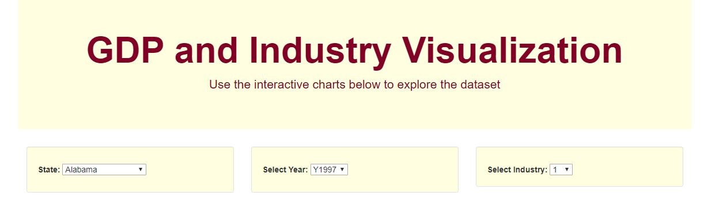
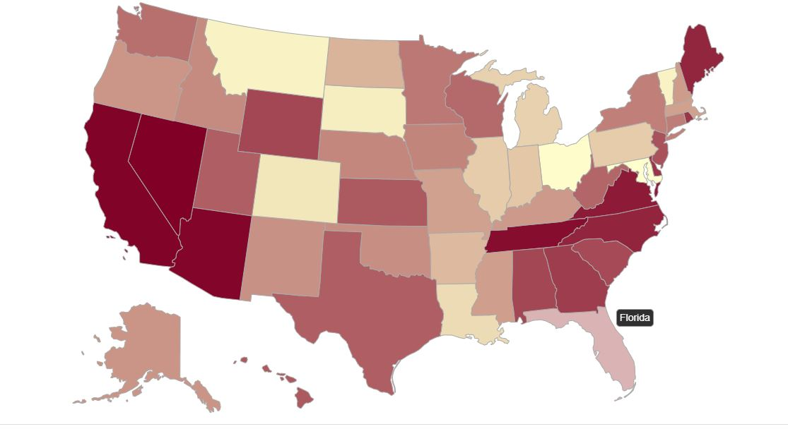
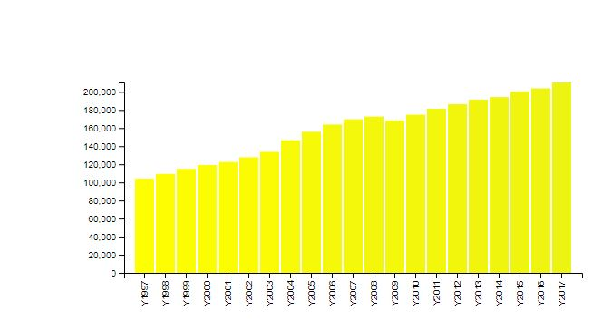

# Interactive Visulization of US GDP by Industry and State

## Description
We wanted to data analytics skills like cleaning, transforming and loading the data and also Visualization skills to show case the findings in an interactive web application. Here are the things we did for this project.

- Data Gathering (Bureau of Economic Analysis - https://apps.bea.gov/iTable/index_regional.cfm) 
- Data Cleanup & Transformation
- Loading the data to SQLITE
- FLASK app to visually report the data
- Flask app to create our API to share the data in JSON Format

## Clone:
* Clone this repo to your local machine using  https://github.com/vgangaprasad/GDP_Industry_Visualization.git

## Built With:
* Bootstrap
* D3
* Chart.js
* Plotly

## Dependencies:
* SQLAlchemy
* Pandas
* Flask
* BeautifulSoup

## File Breakdown:
* Ins_Basic_Querying - Denis.ipynb: scrapes data from apps.bea.gov and converts data frames to json format
* App.py: Flask app to host data
* Templates: folder containing html file
* Static: folder containing css and app.js files

## Contributors:
* https://github.com/deniscohen43
* https://github.com/vgangaprasad
* https://github.com/dmullen4
* https://github.com/congntran92

##Here are some of the images from the Application

### Landing Page

 

### US Map

 

### Bar Chart for the state selected from the Map or Drop Down

